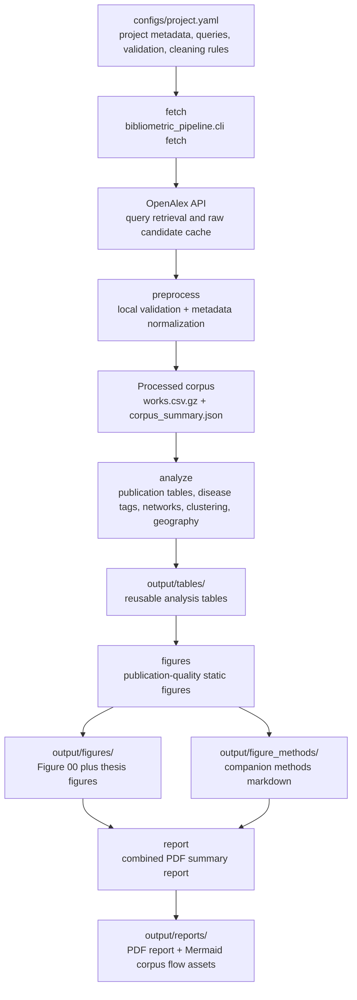

# Reproducible Bibliometric Analysis Pipeline

This repository is a configurable Python pipeline for reproducible bibliometric analysis built on OpenAlex metadata. It fetches a literature corpus, applies a local validation layer, normalizes metadata, generates analysis tables, renders publication-quality figures, writes figure-method companion files, and assembles a combined PDF summary report.

The included example configuration targets the aryl hydrocarbon receptor (AhR) literature, but the architecture is now query-driven rather than AhR-only. To reuse the project for another topic, edit the main project config and rerun the workflow.

## What the pipeline produces

- `data/raw/`: cached OpenAlex retrievals and query summaries
- `data/processed/`: validated corpus tables and corpus summaries
- `output/tables/`: reusable analysis tables that support the figures
- `output/figures/`: thesis-ready `.png`, `.pdf`, and `.svg` figures
- `output/figure_methods/`: one markdown companion file per figure
- `output/reports/`: combined PDF report, markdown summary, and Mermaid corpus-flow assets

## Project layout

```text
configs/
  project.yaml
data/
  raw/
  processed/
output/
  figure_methods/
  figures/
  reports/
  tables/
src/
  ahr_bibliometrics/        # legacy package name kept for compatibility
  bibliometric_pipeline/    # generic entrypoint package
README.md
Makefile
requirements.txt
```

## Workflow diagram



## Main configuration

The pipeline is driven by a single file:

- [`configs/project.yaml`](/home/trhova/thesis_2026_writing/configs/project.yaml)

That config contains:

- project metadata and output prefix
- OpenAlex API settings
- search filters and query definitions
- validation rules for ambiguous acronyms or topic-specific exclusions
- text normalization, aliases, and stopwords
- disease/application dictionaries
- time slices, focus subsets, and report figure order
- topic-specific concept-cleaning resources used by the advanced map figures
- optional-product settings for exploratory analyses such as cancer stance screening and phrase-level co-occurrence maps

## Included example: AhR

The shipped example config uses a conservative AhR retrieval strategy based on:

- exact title/abstract phrase queries for `aryl hydrocarbon receptor`, `ah receptor`, and `dioxin receptor`
- title-level `AHR` hits
- local validation rules that reject common non-biological acronym uses

This is intentionally precision-oriented. The goal is a defendable corpus for thesis figures rather than the largest possible noisy retrieval.

## Installation

```bash
python3 -m venv .venv
source .venv/bin/activate
pip install -r requirements.txt
```

## Running the workflow

Run everything:

```bash
make all
```

Or run step by step:

```bash
make fetch
make preprocess
make analyze
make figures
make report
```

Render optional figures on demand without changing the default report order:

```bash
PYTHONPATH=src python3 -m bibliometric_pipeline.cli figures --include \
  figure_11_cancer_stance_over_time \
  figure_12_global_phrase_map
```

The generic CLI entrypoint is:

```bash
PYTHONPATH=src python3 -m bibliometric_pipeline.cli all
```

You can also point the CLI at another project config:

```bash
PYTHONPATH=src python3 -m bibliometric_pipeline.cli all --config /path/to/project.yaml
```

## Output report

The reporting step builds a combined PDF report in `output/reports/` that includes:

- a summary page with key corpus statistics
- a corpus filtering / retention overview
- all generated figures in configured order

Optional figures can be generated and documented without adding them to the default report. To include them in the combined PDF, append their stems to `reporting.figure_order` in the active config.

The optional cancer-stance workflow uses a local Ollama model for per-abstract structured classification as a sensitivity check against the rule-based labels. By default the config targets `qwen2.5:3b` at `http://127.0.0.1:11434/api/generate`, scores the full AhR+cancer subset when enough text is available, and caches classifications under `data/processed/` so reruns do not re-score the same papers. On CPU this step is still slow enough to be treated as a resumable long-running job rather than a lightweight analysis pass.

To run only the cancer-stance LLM pass without recomputing the rest of the pipeline:

```bash
PYTHONPATH=src python3 -m bibliometric_pipeline.cli cancer-stance
```

This writes `output/tables/cancer_stance_labels.csv`, including the paper title, abstract, the exact model input text, rule-based stance, local-LLM stance, and confidence values for later manual review.

The same step also writes Mermaid corpus-flow assets so the retention diagram can be reused in documentation or thesis materials.

## Adapting to a new topic

To repurpose the repo for another literature question:

1. Copy [`configs/project.yaml`](/home/trhova/thesis_2026_writing/configs/project.yaml).
2. Update `project.name`, `project.short_name`, and `project.output_prefix`.
3. Replace the search queries and validation rules in the `search:` section.
4. Adjust the synonym mappings, stopwords, focus-tag patterns, and disease/theme dictionaries.
5. Rerun the pipeline.

For simple use cases, editing the query, validation, aliases, and stopwords may be enough. For highly domain-specific concept maps, you may also want to update the `analysis:` concept canonicalization and text-marker sections so the clustering and network outputs remain interpretable.

## Reproducibility notes

- The current AhR figures and tables remain the reference example output.
- The advanced term-map figures are deliberately pruned for readability rather than exhaustiveness.
- OpenAlex abstract coverage is incomplete, so some analyses rely on titles plus available metadata rather than abstracts alone.
- Dictionary-based disease/application tagging is approximate and multi-label by design.
- The cancer stance analysis is intentionally conservative: rule-based abstract/title framing is the primary result, while the local sentence-transformer layer is only a sensitivity check.
