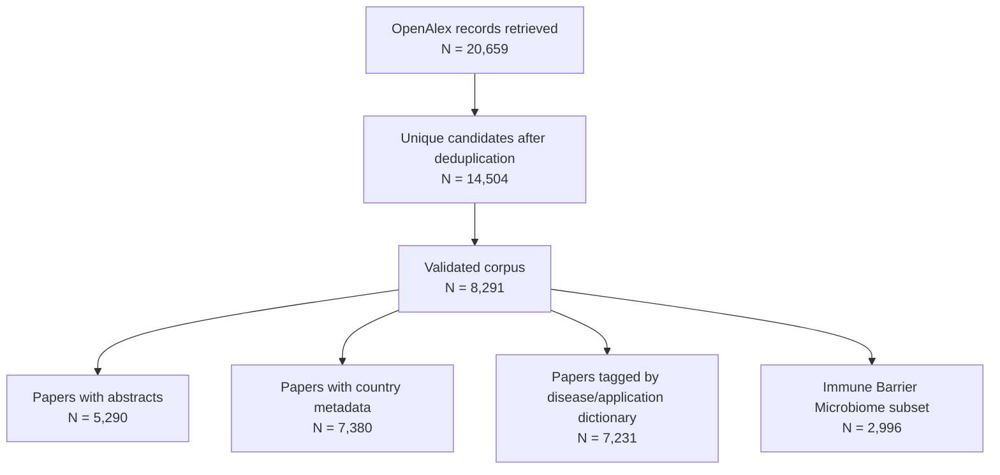

# Aryl hydrocarbon receptor literature Report

- Corpus name: Validated AhR OpenAlex corpus
- Time window: 1980 to 2026
- Validated papers: 8,291
- Abstract coverage: 5,290 papers (63.8%)
- Country metadata coverage: 7,380 papers (89.0%)
- Disease/application tag coverage: 7,231 papers (87.2%)

## Corpus flow

## Included figures
- figure_01_publications_over_time: Figure 01. AhR literature growth over time
- figure_02_disease_application_distribution: Figure 02. Disease and application distribution across the AhR corpus
- figure_03_disease_application_trends: Figure 03. Disease and application trends across AhR field eras
- figure_04_keyword_network_all_corpus: Conceptual Landscape of AhR Research
- figure_05_keyword_network_immune_barrier_microbiome: Immune-Microbiome-Barrier AhR Sublandscape
- figure_06_thematic_evolution: Thematic Evolution of AhR Research
- figure_07_thematic_cluster_map: Document Landscape of AhR Research Themes
- figure_08_top_journals: Figure 08. Journals most frequently publishing AhR papers
- figure_09_global_geography_of_ahr_research: Global AhR Research Output
- figure_10_global_geography_of_ahr_research_per_capita: Global AhR Research Output Per Capita
